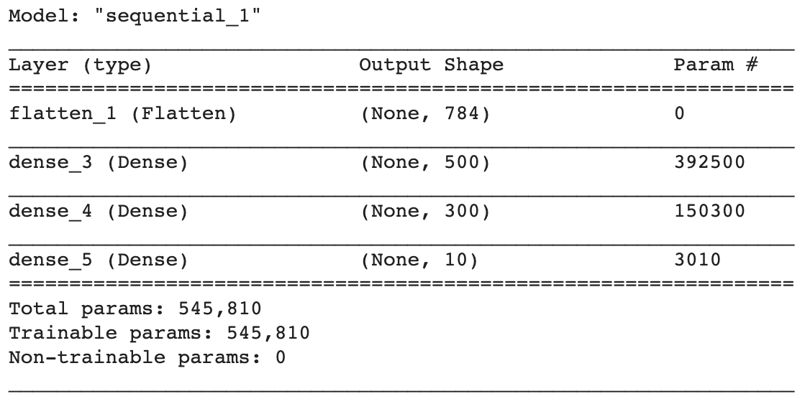

## Compile your model

Now that you've designed your model, you need to compile it. Compiling a model prepares it for training, giving it instructions on how to improve itself — which we call the model's **optimizer**, and on how to measure that improvement using a **loss function** — a mathmatical rule that the model uses to tell how well it's doing in traing. 

The optimizer works to make the loss as small as possible by trying out different rules over passes through groups of images, called **batches** from the training data. At the start of a batch the optimizer adjusts the rules based on how well the loss function told the optimizer the model worked in in the last batch (the first batch will use random rules). Then it feeds every image into the model with the new rules and checks its losses again. It repeats until it has used all of the training data and then goes through the whole set of training data again, as many times as you tell it to. Each complete pass through the training data is called an **epoch**. The optimizer also uses the validation data to make sure it is not learning rules that work only on the training data, a problem called **overfitting**, because training a model is sometimes called **fitting** it.

Programmers don't usually write their own optimizers or loss functions. They use functions created by experts in mathmatics and machine learning. Choosing the right ones may take some research, and a little experementation — for example training the model using two different optimizers and measuring which produces the best result. In the case of this problem, the Adam optimizer is a good choice, as is a loss function called sparse categorical crossentropy loss. Both of these are built into TensorFlow for you.

--- task ---

In the next empty cell, add this code to compile your model and see a summary of its structure.

```python
model.compile(optimizer='adam',
              loss=tf.keras.losses.SparseCategoricalCrossentropy(),
              metrics=['accuracy'])

model.summary()
```

--- /task ---

The **metric** you've added is 'accuracy' — this is a percentage mesuare of how many images the model guessed correctly. The optimizer knows this by checking the image against its label after the model has made a guess. When you are training the model you'll be able to watch this value go up. A score of 1.0 for accuracy is 100% and would mean the model got everything right. 

Usually there are some unusual examples in the data, which we call **outliers**. A well trained model may still get them wrong, and so only have an accuracy score between 0.9 and 1.0, but this is not a bad thing. Getting 1.0 would usually suggest that the model has learned some rules that only apply to the training data and so has become overfitted.

--- task ---
Run all the code and look at the model summary.
--- /task ---

You should see something like the image below, which shows you each of your four layers. 



The first colum is the type of the layer, the second is the outputs it provides to the next layer, and third is the number of parameters for that layer, which control the model's rules, that the optimizer will be adjusting. At the bottom you can see the total number of parameters, and how many of them you are training — in the case of this model over half a million!

--- save ---