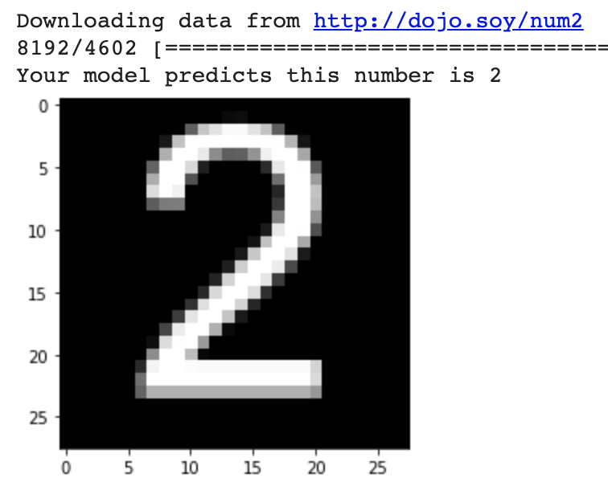

## Test your model

Now that you've trained your number recognition model, it's time to see how well it does on some numbers you create!

--- task ---

In the last empty cell, add a call to `predict_image` and pass it the URL of the test image at [http://dojo.soy/num7](http://dojo.soy/num7).

```python
predict_image('http://dojo.soy/num7')
```

--- /task ---

--- task ---

Run just this cell, so your model doesn't train itself again, by clicking on the ▶ button that appears to the left of it.


--- /task ---

You should see something like the image below, giving you your model's prediction and a preview of the image you loaded.



--- task ---

Use your favourite image editing program to make a square `jpg` file with a drawing of a number. If you don't have an image editor, you can use a website like [sketch.io](https://sketch.io) or can [download and install GIMP](https://www.gimp.org/downloads/). While black, white, and grey images are best, since that's what the model trained on, the function that has been provided to test your model should be able to handle colour `jpg` files too, by automatically converting them to black and white.

--- /task ---

--- task ---

Once you've saved your file you'll need to host it online so Colab can access it. You can use [imagebb](https://imgbb.com/) to put your own images online and then supply the 'direct links' URL to your program. 


--- /task ---

